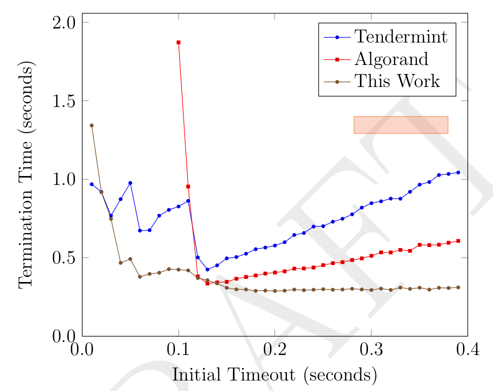

# BFT Simulation

This repository contains a simulation of three BFT consensus algorithms:

- Tendermint (the original, non-responsive version)
- Algorand
- Mir's own consensus algorithm, as described in this [paper](https://mirprotocol.org/papers/consensus.pdf)

Here's a summary of the simulation results:

